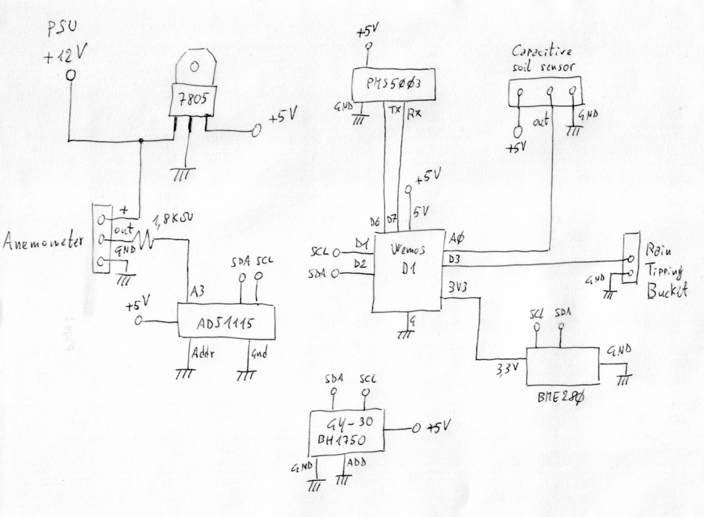
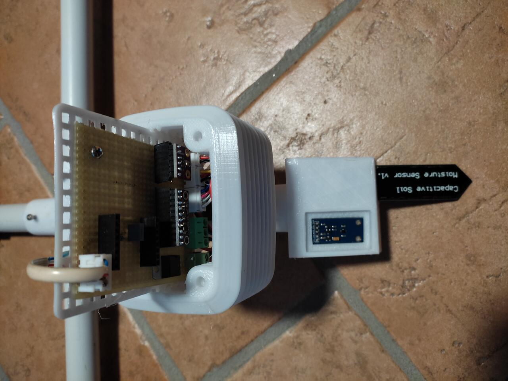
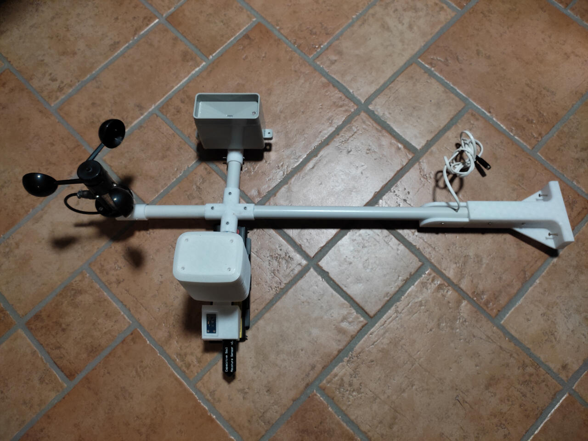

# Compact weather station

## Description

This is a MQTT-enabled, compact weather station powered by a Wemos D1 minicontroller and built with 3D-printed parts. It supports OTA updates.
The weather station is meant to be screwed on a windowsill.

Used sensors and parts are:

- Wind speed: Anemometer with analog voltage output (like https://www.adafruit.com/product/1733)
- Visible light: GY-30 BH1750 Ambient light sensor module
- Air quality/pollution: Digital Particle Concentration Laser Sensor PMS5003
- Rain quantity: Tipping bucket rain gauge (like https://www.bc-robotics.com/shop/tipping-rain-gauge/)
- Rain level: Capacitive soil moisture sensor
- Temperature, humidity, pressure: BME280 Humidity & Pressure Sensor
- Wind speed decoding: ADS1115 16-Bit ADC - 4 Channel with Programmable Gain Amplifier
- LM7805 linear voltage regulator
- 1x 1.8kohm resistor
- 2, 3 & 4 pins JST XH connectors
- 2 & 3 poles PCB screw terminal blocks
- 12V 2A power supply
- M3 Torx screws and bolts
- Cable glands
- 2.54mm / 1 inch PVC pipe

## Schematics

The circuit can be quickly built on a single layer perfboard. It can be powered by a 12V 2A power supply. The onboard LM7805 generates the 5V voltage required for most components. The BME280 sensor is powered at 3.3v directly from the Wemos D1.

## Wemos D1 sketch 

The Wemos sketch can be uploaded using Arduino IDE. The software periodically polls sensors and publishes all readings through MQTT. To reduce wear and extend service life, PMS5003 laser is switched off when not reading.
Over-The-Air updates are supported with no need to physically access the Wemos unit.

The sketch must be configured to point to your MQTT broker and to connect to your WiFi network (see "CUSTOMIZE HERE" sessions)

## 3D components

All parts should be printed using:

- weatherproof filament (ASA or PETG)
- 3 walls
- 0.1mm layer height
- print plate adhesion raft in case it's needed

The Stevenson shield is https://www.thingiverse.com/thing:1053967 printed at 40% of the original size:

- Stevenson_screen_Side_Ring.STL (print 17 times)
- Stevenson_screen_Cover.STL (print once)
- Stevenson_screen_Base.STL (print once)
- 220mmX190mm_Internal_Bracket_for_14_Side_Rings.STL (print once)

The Anemometer 1/4-20 adapter is Anemometer_Adapter_riser_version.stl, from https://www.thingiverse.com/thing:2710360

## Complete build

